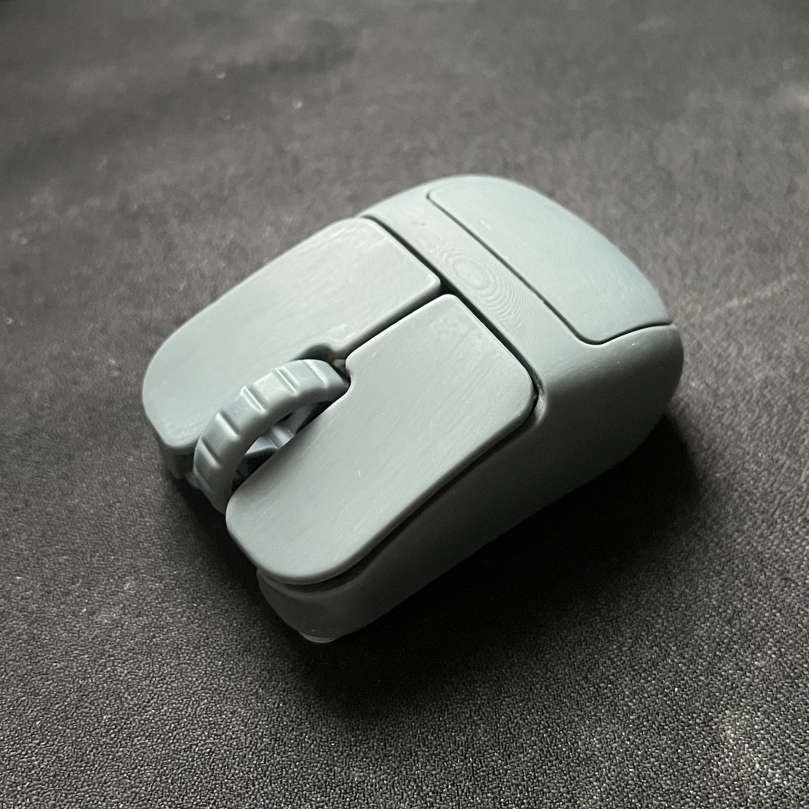
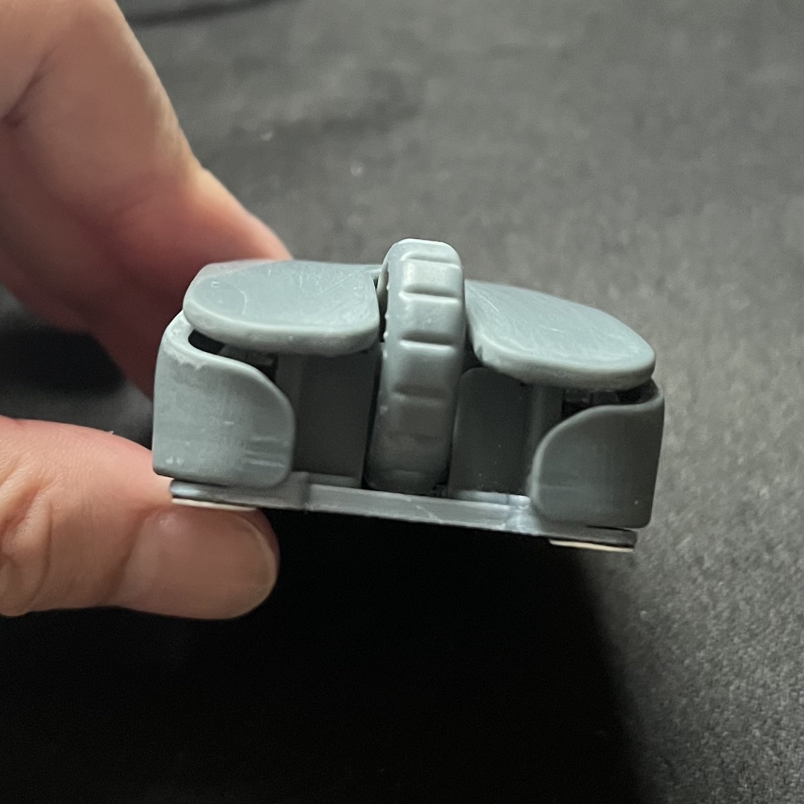
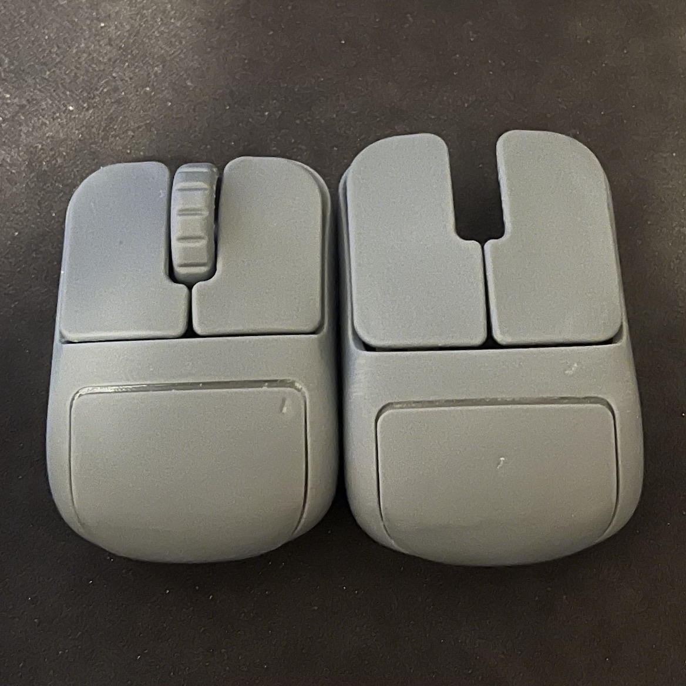
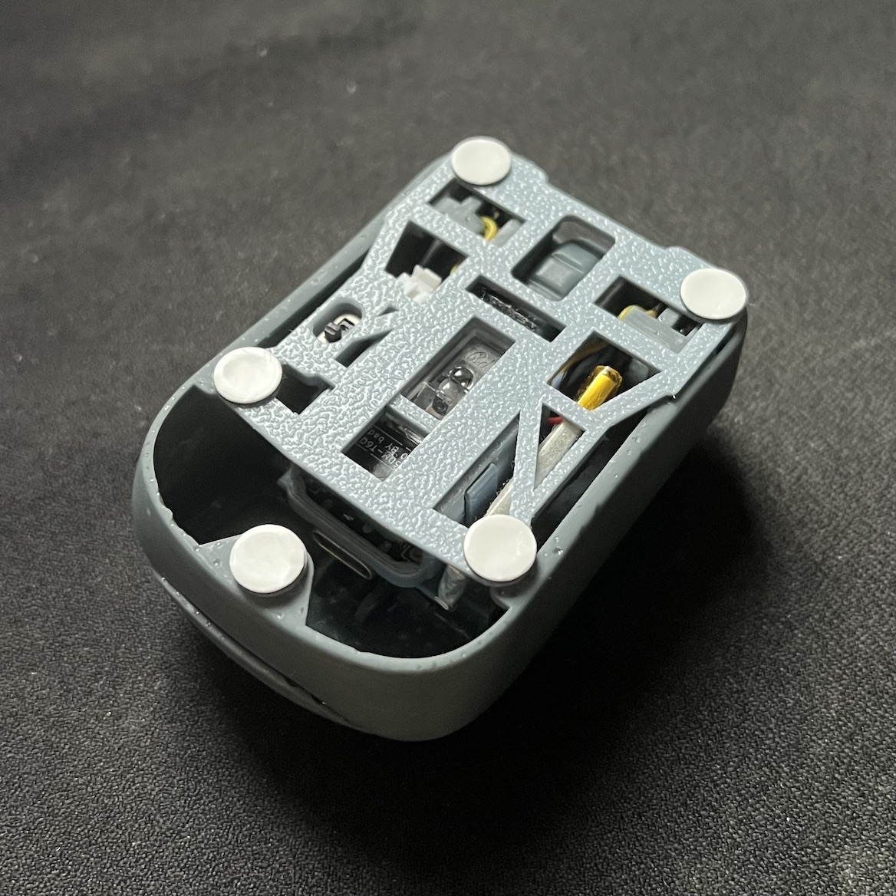
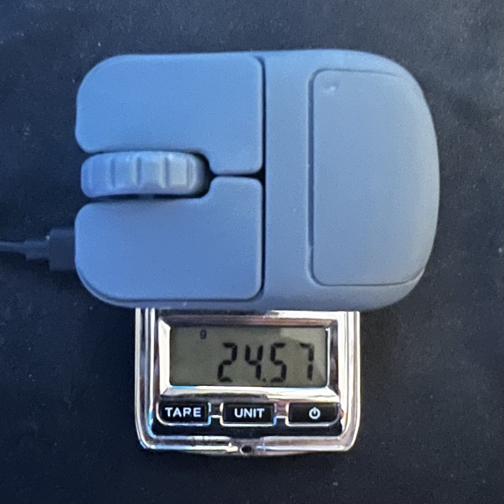
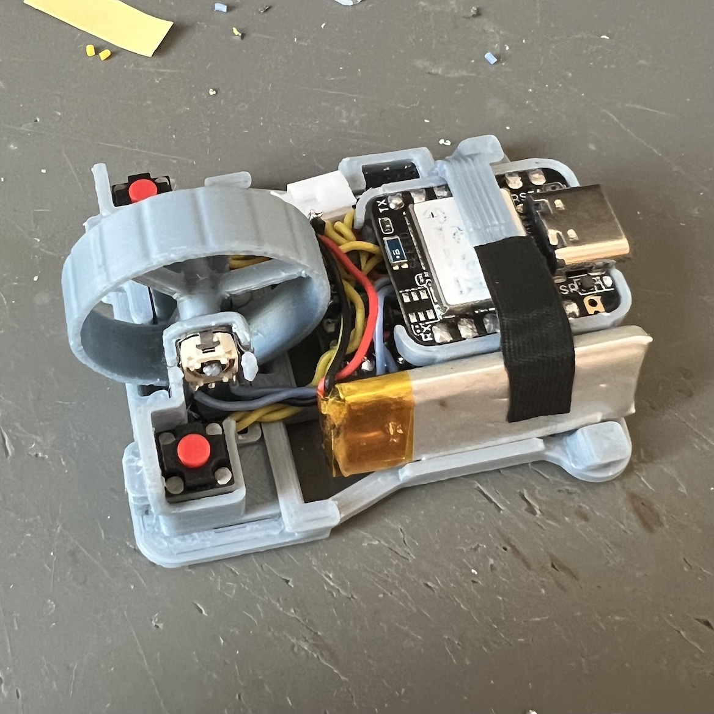
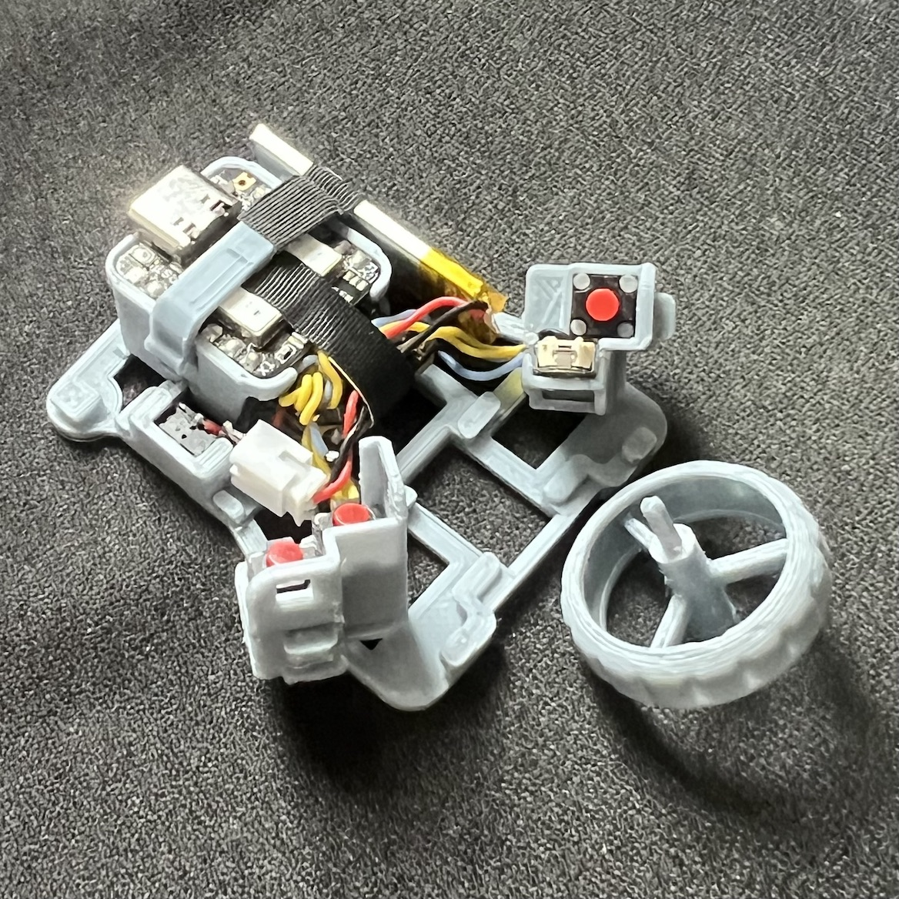
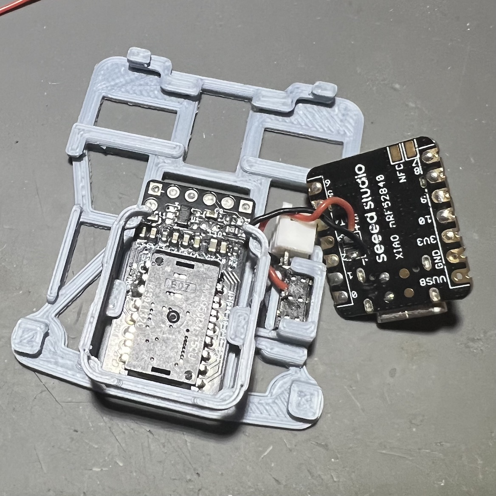
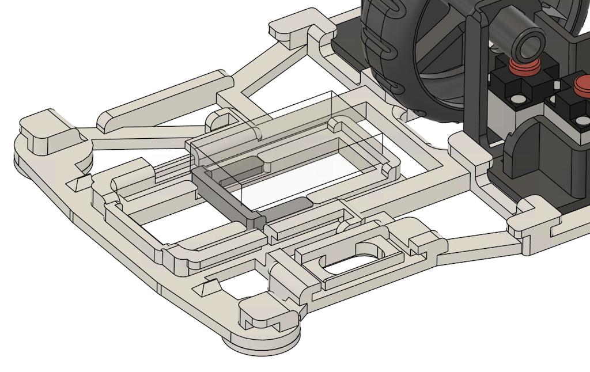
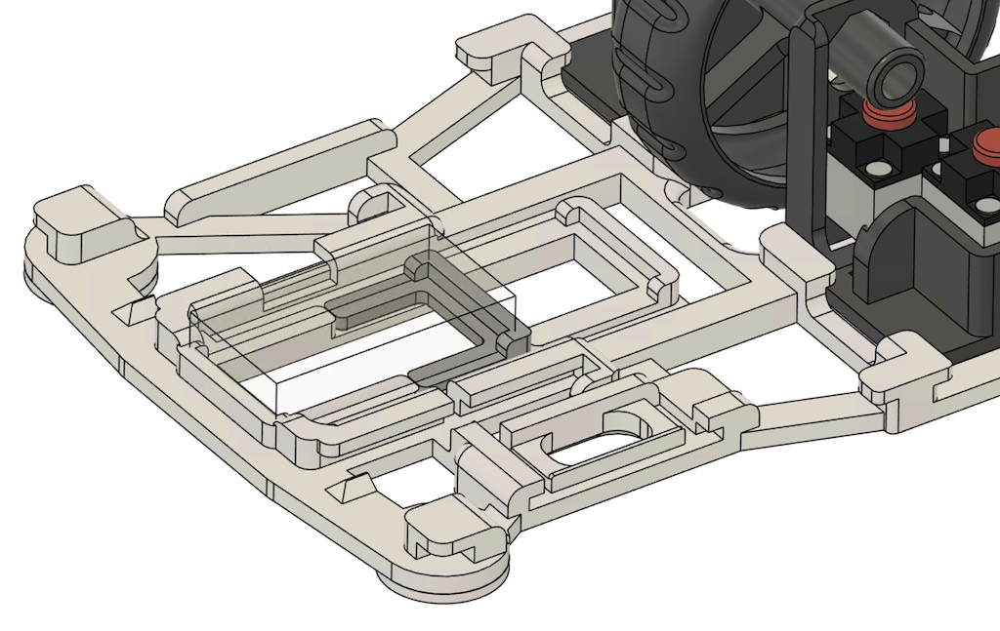

# olliebella

An open source tiny mouse 🐭.

### design principles
- symmetrical computer mouse (2 variants, standard & extended)
- AirPod size (for claw grip grip & finger tip grip)
- screwless 3D puzzle design, utilizing elastic of plastic
- FDM printing printable, optimised for resin printing
- ligthweight. (~25g standard, ~27g extended, with 1.1mm shell wall)
- all gripping surface covering with unique curvy descent, generate unique touch memory of gripping, amplify awaring of grip slip to reduce grip adjustment duration
- eggy rear with narrowing middle bottom, increase side friction, enhance lift control for pull and push movement
- 3 customisable buttons
- not-too-bad middle click and scroll wheel
- for PAW3950/PAW3395 breakout pcb. https://github.com/badjeff/paw3395-pcb
- adjustable sensor position
- powered by [ZMK](https://github.com/zmkfirmware/zmk) => OSS, on-devie profiling, say no to (logxtxxh|razxx) eco-system
- rigid exoskeleton design. (Zero crackly sound; `rigidity = ++compress;`)
- stupidly easy facelifting. (see CAD file, open soruced, playback the timeline)
- fair battery life
- silent tactile switches

### gallery

### bom
|unit|item|
|-|-|
|1|Seeed Studio XIAO BLE (nRF52840 or nRF54 series)|
|1|PAW3950/PAW3395 Sensor with LOAE-LSI1 Lens [Breakout Board](https://github.com/badjeff/paw3395-pcb)|
|3|Kailh CMI627301D07 6x6x7.3mm Silent Micro Switch|
|3|1N4148W T4 SOD-123 Diode (or, any lightweight package)|
|1|ALPS EC05-E1220401 (Vertical) Rotary Encoder|
|1|MSK-1153 6 Pins Power Switch|
|1|301230 Lipo Battery (plus connector) (or, 601230)|
|5|Thick Mouse Feet Skates Dots (7.5mm diameter x ~0.7mm tall)|
|1|30/28/26 AWG silicone wire|

### building guide / tips

- NOT for beginner. Requiring IQ 120+ and experience of building at least one pointing peripheral on [ZMK](https://github.com/zmkfirmware/zmk).
- should inspect CAD file (Fusion360 archive file, or STEP file) before puzzling
- lens-to-surface distance is ~2.4mm (+/-0.2mm) by design. Assuming all mouse feet is ~0.65mm tall.
- thickless of shell could be adjusable in Fusion360 timeline. default thickless as 1.1mm, thick it up to 1.2mm would be easier to print and gain ~0.5g, down to 1.0mm is the minimum tested and works for FDM printing.
- TWO sensor position option available.
  | center | rear |
  |-|-|
  |  |  |

### firmware

the ZMK firmware config repository can be find at [badjeff/zmk-config/tree/esb-shield-only](https://github.com/badjeff/zmk-config/tree/esb-shield-only). Check config files prefixing `boards/shields/donki36/donki36_mou3.*`.

> [!IMPORTANT]
> - Should ONLY use this with [zmk-feature-split-esb](https://github.com/badjeff/zmk-feature-split-esb) dongle. 
> - Not rational to use PAW3950/PAW3395 sensor over BLE.

## license

available under the [CERN-OHL-P v2](/LICENSE) permissive license.
